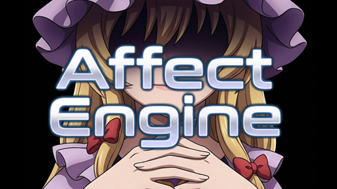

  

# Yakumo.AffectEngine

Emotion analysis library for .NET 8 — understands **Japanese and English** feelings in text.  
Built on GoEmotions RoBERTa (ONNX) with DirectML support for fast GPU/CPU inference.

🧠 Yakumo.AffectEngine is a **static AI**: pretrained deep-learning models run frozen-weight
inference fully on your machine — no runtime learning, no cloud, reproducible results.
Tunable via configuration and user dictionaries (proper nouns, phrases, and translation fixes).

.NET 8 向け感情分析ライブラリ。**日本語・英語**のテキストから感情を読み取ります。  
GoEmotions RoBERTa (ONNX) を採用し、DirectML で GPU/CPU 高速推論に対応。

🧠 本ライブラリは**静的AI**です — 学習済み深層学習モデルによる固定重み推論を
完全ローカルで実行します。実行時学習なし・クラウド不要・再現性のある結果。
設定ファイルによるチューニングと、ユーザー辞書（固有名詞・フレーズ・誤訳補正）に対応。

---

📝 Note: A ready-to-run package (sample app + installer) is available on the [Releases](https://github.com/dr-yakumo/Yakumo.AffectEngine/releases) page.
📝 注記: すぐに使えるパッケージ（サンプルアプリ + インストーラー同梱の ZIP）は [Releases](https://github.com/dr-yakumo/Yakumo.AffectEngine/releases) ページから入手できます。

## Documentation / ドキュメント

- 📖 [Public API Reference (English)](Yakumo.Affect/YAKUMO_NLI_API_en.md)
- 📖 [公開 API リファレンス（日本語）](Yakumo.Affect/YAKUMO_NLI_API_jp.md)

## Features / 機能

- 🎭 **14-label multi-label emotion classification** (joy, sadness, anger, fear, disgust, surprise, neutral, and more)  
  **14ラベル多ラベル感情分類**（喜び・悲しみ・怒り・恐れ・嫌悪・驚き・中立 など）
- 🌐 **Bilingual support** — Japanese input auto-translated to English for inference  
  **日英バイリンガル対応** — 日本語入力は自動翻訳して推論
- ⚡ **DirectML GPU acceleration** with automatic CPU fallback  
  **DirectML GPU アクセラレーション**対応、CPU への自動フォールバックあり
- 🔌 **Plugin-based filter architecture** via `IEmotionFilter` interface  
  `IEmotionFilter` インターフェースによる**プラグイン式フィルタ構成**
- 🛡️ **Polarity Gate** (optional) — resolves positive/negative emotion conflicts for higher coherence  
  **Polarity Gate**（オプション） — ポジティブ/ネガティブ感情の矛盾を解消し、分類精度を向上
- 📦 **No cloud dependency** — fully local inference via ONNX Runtime  
  **クラウド不要** — ONNX Runtime による完全ローカル推論

---

## Requirements / 動作要件

### Runtime / ランタイム
- [.NET 8.0 Runtime](https://dotnet.microsoft.com/download/dotnet/8.0)
- Python 3.9 or later — required for Japanese translation / 日本語翻訳に必要
- [Microsoft Visual C++ Redistributable (x64)](https://aka.ms/vs/17/release/vc_redist.x64.exe) — required by PyTorch / ONNX Runtime. The installer can set it up automatically / PyTorch・ONNX Runtime の実行に必要（インストーラーが自動導入できます）

### Python packages / Python パッケージ
pip install flask transformers torch sentencepiece protobuf

### Models / モデル (auto-downloaded by install.ps1 / install.ps1 が自動ダウンロード)
- `SamLowe/roberta-base-go_emotions` — emotion classification model (ONNX) / 感情分類モデル
- `facebook/nllb-200-distilled-600M` — Japanese → English translation via Flask server / 日英翻訳サーバー

### Optional / オプション
- DirectML-compatible GPU (AMD / Intel / NVIDIA) — for faster inference / 高速推論に使用

### 🛠️ Setup / セットアップ
- Download the ZIP from the [Releases](https://github.com/dr-yakumo/Yakumo.AffectEngine/releases) page and run `install.bat` — Python packages and ONNX models are set up automatically. (.NET 8.0 Runtime and Python 3.9+ must be installed beforehand.)
- [Releases](https://github.com/dr-yakumo/Yakumo.AffectEngine/releases) ページから ZIP を取得して `install.bat` を実行してください。Python パッケージの導入と ONNX モデルの取得は自動で行われます（.NET 8.0 Runtime と Python 3.9+ は事前にインストールしておいてください）。
---

## License / ライセンス

The core library (`Yakumo.Affect`) is licensed under the **MIT License**.  
See [LICENSE](LICENSE) for details.  
コアライブラリ（`Yakumo.Affect`）は **MIT ライセンス** で提供されます。

The optional Polarity Gate plugin (`Yakumo.Affect.PolarityGate.dll`) is distributed as **binary only** under the **Apache License 2.0**.  
See [NOTICE_PolarityGate](Yakumo.Affect.PolarityGate/NOTICE_PolarityGate) for details.  
オプションの Polarity Gate プラグイン（`Yakumo.Affect.PolarityGate.dll`）は **バイナリのみ配布** で、**Apache License 2.0** が適用されます。

### Third-party notices / サードパーティ表示

| Component | License |
|---|---|
| Microsoft.ML.OnnxRuntime | MIT |
| Microsoft.ML.Tokenizers | MIT |
| SamLowe/roberta-base-go_emotions | MIT |
| facebook/nllb-200-distilled-600M | CC-BY-NC-4.0 ⚠️ |
| sentence-transformers/all-MiniLM-L6-v2 | Apache 2.0 |
| Flask | BSD-3-Clause |
| transformers (HuggingFace) | Apache 2.0 |

> ⚠️ `nllb-200-distilled-600M` is licensed under **CC-BY-NC-4.0 (non-commercial use only)**.  
> For commercial use, please replace with an alternative translation model.  
> `nllb-200-distilled-600M` は **CC-BY-NC-4.0（非商用限定）** です。商用利用の場合は代替翻訳モデルへの差し替えが必要です。

---

## Contributing / コントリビューション

This repository does not accept pull requests.  
Feel free to fork and modify for your own use.  
このリポジトリはプルリクエストを受け付けていません。  
フォークして自由にご利用ください。

---

## Disclaimer / 免責事項

This library is provided "as is", without warranty of any kind, express or implied.  
The author(s) shall not be held liable for any damages arising from the use of this software.  
Use at your own risk.

本ライブラリは現状有姿で提供されます。  
本ソフトウェアの使用によって生じたいかなる損害についても、開発者は一切の責任を負いません。  
ご利用は自己責任でお願いします。